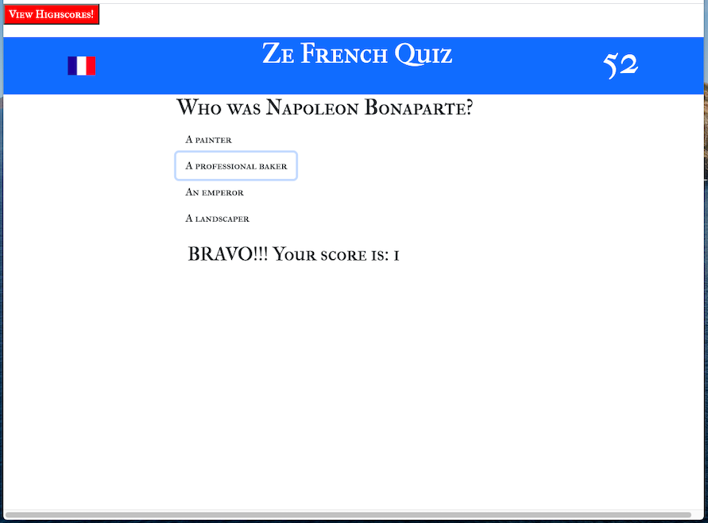
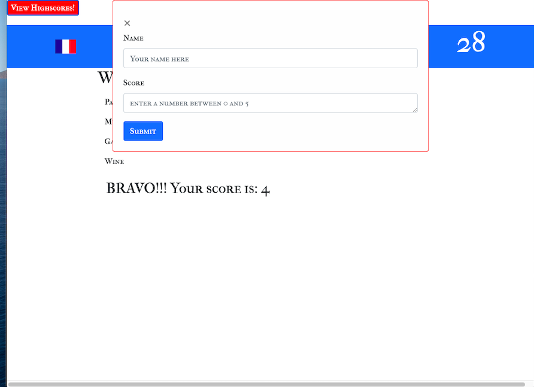

# Web APIs: Ze French Quiz

## Description

This ia a quiz with multiple-choice questions. This app runs in the browser and features dynamically updated HTML and CSS powered by JavaScript code. It also features a clean and polished user interface and is responsive - adapts to multiple screen sizes.

## Web app screenshot

## Links submission

- [URL of the deployed application](https://jessicaperez1.github.io/Ze-French-Quiz/)
- [URL of the GitHub repository](https://github.com/JessicaPerez1/Code-Quiz.git)
